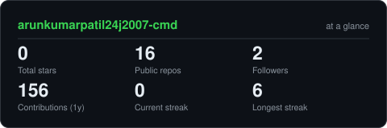
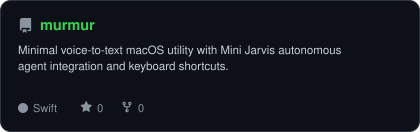
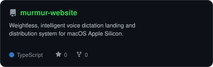
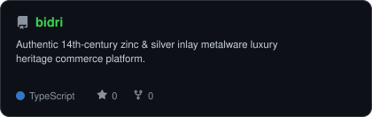
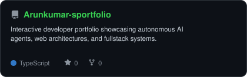

<div align="center">

<!-- PORTRAIT - generated by scripts/dotify.py from your photo.
     Colour mode, so one file serves both GitHub themes. Regenerate with:
       python scripts/dotify.py assets/arun_studio_cutout_feathered.png -o assets/portrait \
         --cols 100 --equalize --detail 0.5 --color --reveal -->


<br>

<!-- NAME / TAGLINE - animated typing in hacker terminal green -->
<a href="https://github.com/arunkumarpatil24j2007-cmd">
  
</a>

<br>

<!-- SOCIALS -->
<a href="https://linkedin.com/in/arunkumarpatil24"></a>
<a href="mailto:arunkumarpatil24j2007@gmail.com"></a>
<a href="https://github.com/arunkumarpatil24j2007-cmd/Arunkumar-sportfolio"></a>
<a href="https://codeforces.com"></a>
<a href="https://leetcode.com"></a>


</div>

---

## `~/` whoami

```console
$ cat about.txt
```

Hi, I'm **Arun Kumar Patil**. I build systems that sit somewhere between autonomous AI agents, machine learning, and high-performance applications, and I solve hard problems for fun when neither of those is cooperating.

- Currently building **[Murmur](https://github.com/arunkumarpatil24j2007-cmd/murmur)** (voice-to-text macOS utility with Mini Jarvis autonomous agent integration) and **[Bidri](https://github.com/arunkumarpatil24j2007-cmd/bidri)**
- Exploring **Autonomous Multi-Agent Runtimes + Apple Silicon Acceleration**
- Learning **Distributed Agent Architectures + High-Performance Inference**
- Fun fact: **I get ideas. I build them. Sometimes they work.**

<br>

<div align="center">

## `~/` toolbox


</div>

---

<div align="center">

## `~/` skill radar

<table>
<tr>
<td width="50%" align="center" valign="middle">

<!-- Self-rated radar - edit assets/skills.json, the workflow redraws it -->
<picture>
  <source media="(prefers-color-scheme: dark)"  srcset="assets/radar-dark.svg">
  <source media="(prefers-color-scheme: light)" srcset="assets/radar-light.svg">
  
</picture>

</td>
<td width="50%" align="center" valign="middle">

<!-- Live radar built from real language byte counts across your repos -->
<picture>
  <source media="(prefers-color-scheme: dark)"  srcset="assets/radar-langs-dark.svg">
  <source media="(prefers-color-scheme: light)" srcset="assets/radar-langs-light.svg">
  
</picture>

</td>
</tr>
</table>

</div>

---

<div align="center">

## `~/` contribution calendar

<!-- 3D isometric calendar, regenerated every 6h by .github/workflows/metrics.yml -->


<br><br>

<!-- Snake eats the contribution graph - .github/workflows/snake.yml -->
<picture>
  <source media="(prefers-color-scheme: dark)"  srcset="https://raw.githubusercontent.com/arunkumarpatil24j2007-cmd/arunkumarpatil24j2007-cmd/output/snake-dark.svg">
  <source media="(prefers-color-scheme: light)" srcset="https://raw.githubusercontent.com/arunkumarpatil24j2007-cmd/arunkumarpatil24j2007-cmd/output/snake.svg">
  
</picture>

</div>

---

<div align="center">

## `~/` the numbers

<!-- Generated by scripts/cards.py into this repo. Deliberately NOT
     github-readme-stats / streak-stats / github-profile-trophy: those are
     shared public instances that go down and take the whole section with them. -->
<picture>
  <source media="(prefers-color-scheme: dark)"  srcset="assets/card-stats-dark.svg">
  <source media="(prefers-color-scheme: light)" srcset="assets/card-stats-light.svg">
  
</picture>

<br>


<br><br>


</div>

---

<div align="center">

## `~/` selected work

<!-- Cards generated by scripts/cards.py from assets/projects.json.
     Stars, forks and language are pulled live from the API on every run. -->
<table>
<tr>
<td width="50%">
  <a href="https://github.com/arunkumarpatil24j2007-cmd/murmur">
    <picture>
      <source media="(prefers-color-scheme: dark)"  srcset="assets/card-murmur-dark.svg">
      <source media="(prefers-color-scheme: light)" srcset="assets/card-murmur-light.svg">
      
    </picture>
  </a>
</td>
<td width="50%">
  <a href="https://github.com/arunkumarpatil24j2007-cmd/murmur-website">
    <picture>
      <source media="(prefers-color-scheme: dark)"  srcset="assets/card-murmur-website-dark.svg">
      <source media="(prefers-color-scheme: light)" srcset="assets/card-murmur-website-light.svg">
      
    </picture>
  </a>
</td>
</tr>
<tr>
<td width="50%">
  <a href="https://github.com/arunkumarpatil24j2007-cmd/bidri">
    <picture>
      <source media="(prefers-color-scheme: dark)"  srcset="assets/card-bidri-dark.svg">
      <source media="(prefers-color-scheme: light)" srcset="assets/card-bidri-light.svg">
      
    </picture>
  </a>
</td>
<td width="50%">
  <a href="https://github.com/arunkumarpatil24j2007-cmd/Arunkumar-sportfolio">
    <picture>
      <source media="(prefers-color-scheme: dark)"  srcset="assets/card-Arunkumar-sportfolio-dark.svg">
      <source media="(prefers-color-scheme: light)" srcset="assets/card-Arunkumar-sportfolio-light.svg">
      
    </picture>
  </a>
</td>
</tr>
</table>

<sub>

| project | live / repo | stack |
|---|---|---|
| **[murmur](https://github.com/arunkumarpatil24j2007-cmd/murmur)** | [macOS App](https://github.com/arunkumarpatil24j2007-cmd/murmur) | `Swift` `Autonomous Agents` `AudioKit` |
| **[murmur-website](https://github.com/arunkumarpatil24j2007-cmd/murmur-website)** | [Web System](https://github.com/arunkumarpatil24j2007-cmd/murmur-website) | `TypeScript` `Next.js` `TailwindCSS` |
| **[bidri](https://github.com/arunkumarpatil24j2007-cmd/bidri)** | [Heritage Commerce](https://github.com/arunkumarpatil24j2007-cmd/bidri) | `TypeScript` `React` `TailwindCSS` |
| **[Arunkumar-sportfolio](https://github.com/arunkumarpatil24j2007-cmd/Arunkumar-sportfolio)** | [Portfolio Live](https://github.com/arunkumarpatil24j2007-cmd/Arunkumar-sportfolio) | `TypeScript` `React` `Framer Motion` |

</sub>

</div>

---

<div align="center">

<sub>`01110100 01101000 01100001 01101110 01101011 01110011 00100000 01100110 01101111 01110010 00100000 01110011 01100011 01110010 01101100 01101100 01101001 01101110 01100111`</sub>

</div>
